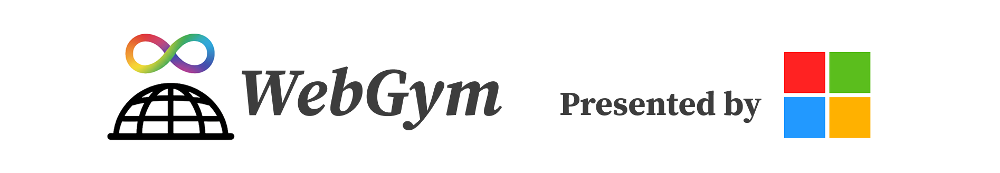
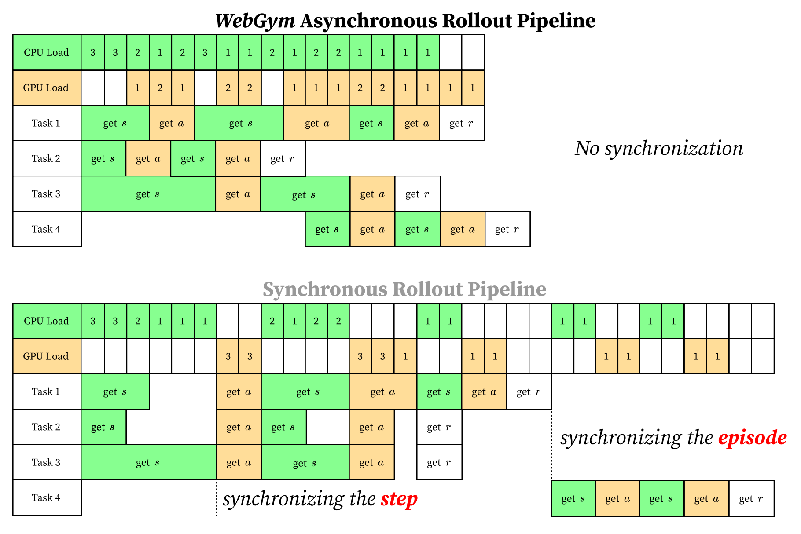
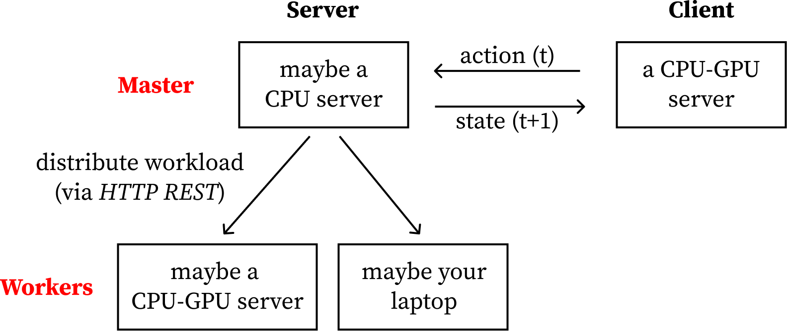
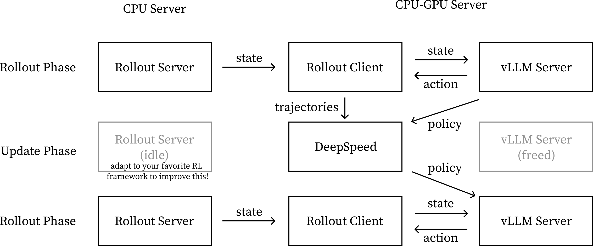

<h1 align="center">WebGym: Scaling Training Environments for Visual Web Agents with Realistic Tasks</h1>

<div align="center">

[](https://arxiv.org/abs/2601.02439)
[](https://webgym.readthedocs.io/en/latest/)
[](https://huggingface.co/datasets/microsoft/webgym_tasks)
[](https://opensource.org/licenses/MIT)
[](https://www.python.org/downloads/)

</div>

<div align="center">
  
</div>

<p align="center">
<a href="https://www.jackgethome.com/"><b>Hao Bai</b></a><sup>1,2*</sup>, <a href="https://www.microsoft.com/en-us/research/people/ataymano/"><b>Alexey Taymanov</b></a><sup>1</sup>, <a href="https://tongzhang-ml.org/"><b>Tong Zhang</b></a><sup>2</sup>,
<br>
<a href="https://aviralkumar2907.github.io/"><b>Aviral Kumar</b></a><sup>3</sup>, <a href="https://www.spencerwhitehead.com/"><b>Spencer Whitehead</b></a><sup>1</sup>
</p>

<p align="center">
<sup>1</sup>Microsoft &nbsp; <sup>2</sup>UIUC &nbsp; <sup>3</sup>CMU
</p>

<p align="center">
<sup>*</sup>Work partly done during internship at Microsoft
</p>

WebGym is a scaled, production-ready, and rollout-efficient RL training framework for web automation agents powered by vision-language models (VLMs).

## System Architecture

You're **highly suggested** to read the content below to understand the designs of this system. These contents are the most valuable insights we summarized that could save you hours if not days for how you should properly make the best uses of the architecture & components of this framework.

- **Fully asynchronous rollout framework**: Our web-agent trajectory rollout framework, Omniboxes, is *fully asynchronous*. Among the trajectories being collected in a batch, there is no synchronization between either steps or episodes. This can average the workload on the machine and avoid the [thundering herd problem](https://en.wikipedia.org/wiki/Thundering_herd_problem). We benchmarked the speed and found WebGym is [4-5x faster](https://arxiv.org/pdf/2601.02439) than the naive synchronous implementation.

<div align="center">
  
</div>

- **Portable & scalable rollout server**: We adopt a server-client architecture to allow the user to host the Omniboxes server *anywhere*. The rollout server (essentially an orchestrated set of browser instances which actually consumes resources) can be hosted on a separate CPU machine, a CPU-GPU machine where you use GPU for some other jobs, or just your PC. We provide multi-node support so that you can even wire everything up. Just provide the public IP or interconnected internal IP, and make one node the master node. This server code can be easily adapted to your own applications as well, not just for web.

<div align="center">
  
</div>

- **Monitored rollout client.** The client runs the rollout collection loop, which involves generating an action and send to the rollout server, implemented with a two-level FIFO queue. The server will process the action and generate an updated state. As this process involves a ton of threads, we monitor them by representing each thread as a cell. Here we introduce the **WebGym Task Monitor** - it displays all the information you care about the individual rollout threads, like which step it is in, what status is it in (is it generating the action? is it waiting for server to respond with a state?), and the statistics of these statuses over all threads.

<div align="center">
  
</div>

- **Multi-node fully-synchronous RL framework**: We fully support multi-node rollout collection and training. In each iteration, if you have *k* CPU-GPU machines, the framework collects trajectories on *k* machines, then frees the memory on all these *k* machines, and then trains on trajectories on *k* machines. We assume these machines have some shared storage. For rollout collection, we use **vLLM** as inference server. For training, we use **LLaMA-Factory**. We manage the RL loop with a `run.sh` script. The RL loop is fully synchronous, without any token-level or checkpoint-level asynchronous designs, to make off-policyness as minimal as possible. **WebGym avoids using any RL-framework** for you to easily extract the rollout framework code to apply to your own RL framework (veRL, Slime, PipelineRL, etc.).

<div align="center">
  
</div>


## Web Agent Designs

- **Policy and interaction**: We natively support the Qwen-VL model series as the agent policy. We support two interaction modes: Set-of-Marks (SoM) and coordinate-based interaction. In the SoM mode, the rollout server will respond with the screenshot with interactive elements and an accessibility tree of the webpage, which allows the agent to use element ids to refer to the elements in the screenshot. In the coordinate-based interaction mode, only the screenshot will appear in the response, and the policy has to output coordinates instead of labels. By default, we use the coordinate-based interaction mode, following [recent discussions led by Yutori AI](https://yutori.com/blog/the-bitter-lesson-for-web-agents).

- **Context Management**: Following the [Qwen-VL convention of web agentic training & inference](https://github.com/QwenLM/Qwen3-VL/issues/1651), we set multi-turn conversations between the agent and the environment to be managed through a **sliding window** of 4 rounds. Each round is a (state, action) pair, where the state is a screenshot and the response is the model's parsed output. The last 4 rounds are kept as full multimodal messages with images, while older history is compressed into concise text summaries (action taken, effect on page, and webpage name) to stay within the context window budget. Following [the LLaMA-Factory convention](https://github.com/zai-org/GLM-V/), for thinking-variant models (e.g., Qwen3-VL-Think), `<think>` blocks are stripped from conversation history so the model never sees its own prior thoughts. On the output side, responses are parsed via regex into structured fields — Thought, Action, tool_call JSON, and Memory — then the tool_call is extracted into a standardized action format and converted to a browser command.

## Getting Started

Please refer to our <a href="https://webgym.readthedocs.io/en/latest/index.html"><b>ReadTheDocs documentation</b></a> for a quick start. It contains comprehensive information about this codebase.

### Hosting the ReadTheDocs Server

In case you're not able to open this online link, feel free to host it on yourself.

```bash
# Install documentation dependencies
pip install -r docs/requirements-docs.txt
pip install sphinx-autobuild

# Build the documentation
cd docs
bash build.sh

# Host with live reload (optional)
bash host.sh  # Serves at http://localhost:8000
```

The `host.sh` script uses `sphinx-autobuild` to automatically rebuild and serve the documentation with live reload whenever you make changes to the source files.

## Citation

We hope you can kickstart exciting projects with WebGym! If you use the WebGym code for your project, please kindly cite with:

```
@article{bai2026webgym,
  title={WebGym: Scaling Training Environments for Visual Web Agents with Realistic Tasks},
  author={Bai, Hao and Taymanov, Alexey and Zhang, Tong and Kumar, Aviral and Whitehead, Spencer},
  journal={arXiv preprint arXiv:2601.02439},
  year={2026}
}
```
