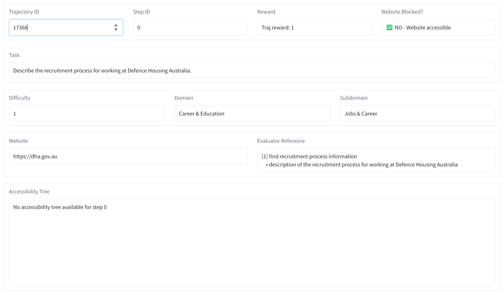
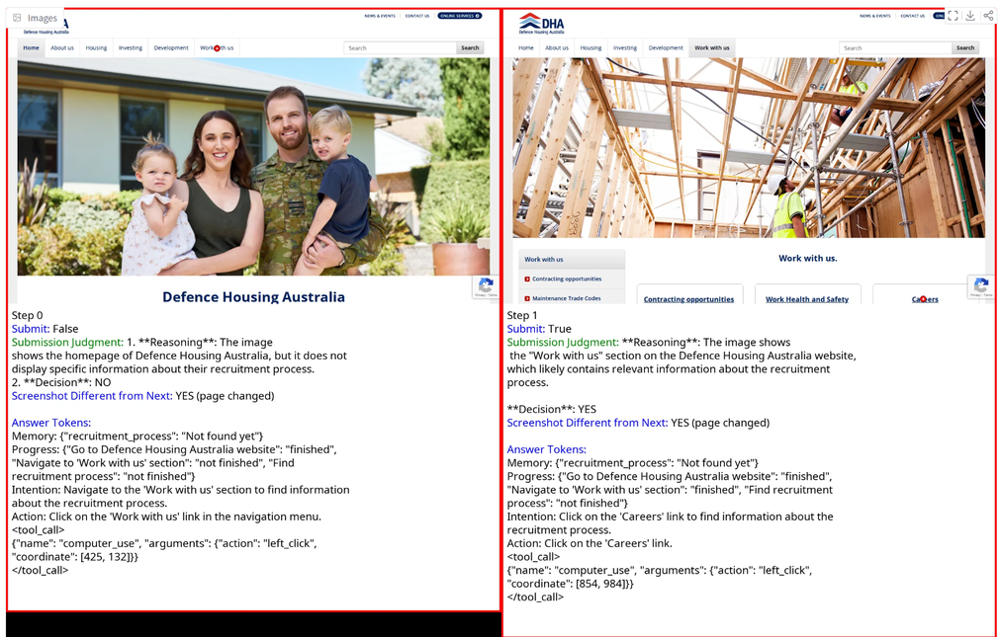
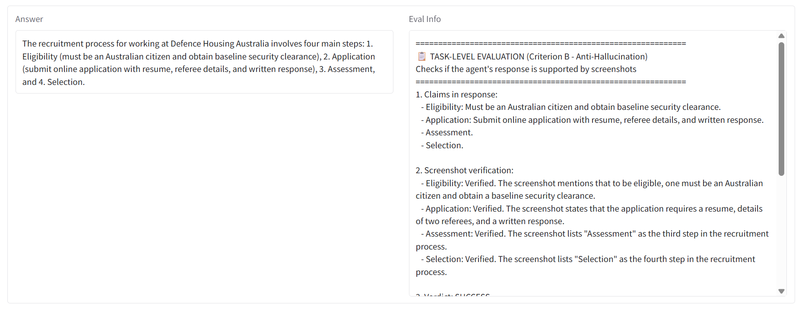
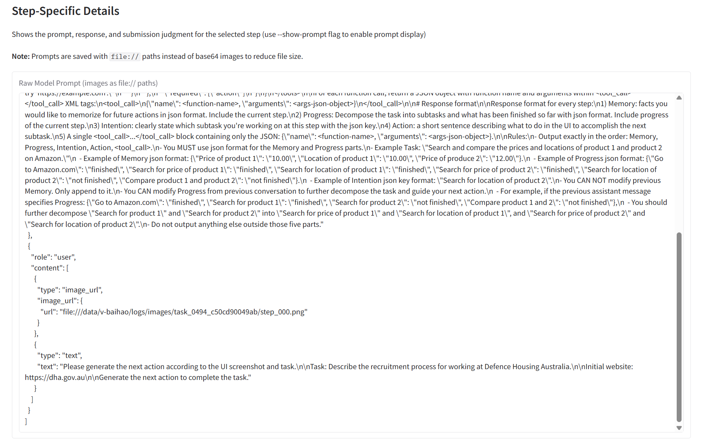
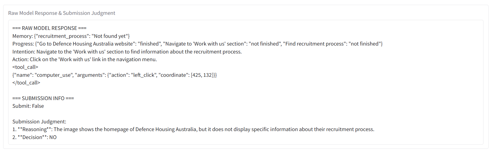
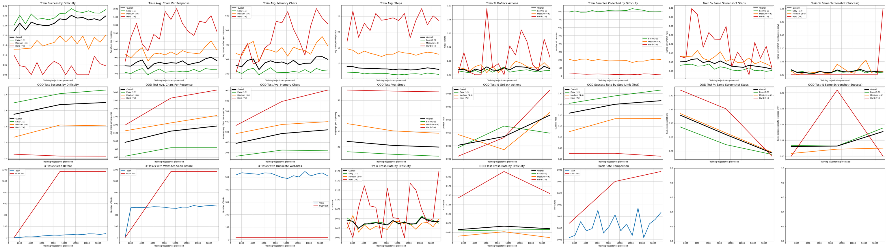
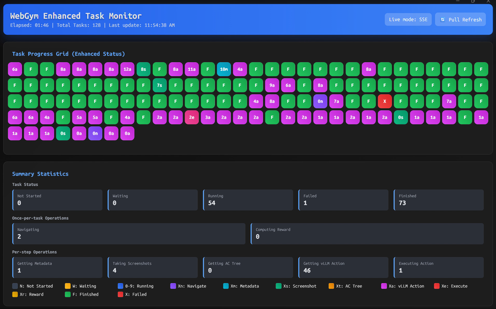

Viewer
======

The analysis tools are located in ``analysis/``:

.. code-block:: text

   analysis/
   ├── view_trajs.py           # Trajectory viewer (Gradio web interface)
   ├── visualize_results.py    # Training/test metrics visualizer (matplotlib)
   └── font_manager.py         # Font downloading and caching for Unicode support

The trajectory visualizer (``analysis/view_trajs.py``) provides a Gradio-based web interface for inspecting agent trajectories step-by-step.

**Usage:**

.. code-block:: bash

   python analysis/view_trajs.py <split> [OPTIONS]

**Arguments:**

* ``split`` (required): Which split to view - ``train`` or ``test``

**Options:**

* ``--data-path <path>`` (required): Data directory path (e.g., ``/home/v-baihao/data``).
* ``--log-path <path>`` (required): Logs directory path (e.g., ``/home/v-baihao/logs``).
* ``--show-prompt``: Display both prompt and response for each step.
* ``--position <first|last>``: Load first or last N iterations (default: load all). Must be used with ``--num-iterations``.
* ``--num-iterations <N>``: Number of iterations to load (used with ``--position``).

**Examples:**

.. code-block:: bash

   # View train trajectories
   python analysis/view_trajs.py train --data-path /home/v-baihao/data --log-path /home/v-baihao/logs

   # View test trajectories
   python analysis/view_trajs.py test --data-path /home/v-baihao/data --log-path /home/v-baihao/logs

   # View last 5 iterations of train trajectories with prompts
   python analysis/view_trajs.py train --data-path /home/v-baihao/data --log-path /home/v-baihao/logs --position last --num-iterations 5 --show-prompt

**Features:**

* Interactive step navigation with screenshot display
* Action coordinate visualization (red dots on screenshots)
* Task metadata display (difficulty, domain, subdomain, website)
* Reward and evaluation info for each trajectory
* Accessibility tree inspection
* Submission judgment display
* Automatic font fallback for multi-language support

**Interface Overview:**

The viewer is organized into several panels. At the top, the **metadata panel** displays trajectory-level information including the trajectory ID selector, current step, reward, website accessibility status, the task description, difficulty/domain/subdomain classification, website URL, evaluator reference steps, and the accessibility tree for the current step.

Below the metadata, the **step-by-step screenshot panel** shows side-by-side screenshots of consecutive agent steps. Each step includes the screenshot (with red dots marking action coordinates), the submission status, a submission judgment explaining whether the current page satisfies the task, answer tokens tracking the agent's memory and progress, and a flag indicating whether the screenshot changed from the previous step.

When the agent finishes a trajectory, the **answer and evaluation panel** displays the agent's final answer alongside the task-level evaluation. The evaluation applies Criterion B (Anti-Hallucination), checking each claim in the agent's response against the screenshots to verify it is grounded in what was actually observed on screen.

When the ``--show-prompt`` flag is used, the **step-specific details panel** reveals the full prompt sent to the model at each step, including the system message structure, image inputs, and task instructions in their raw JSON format.

The **raw model response panel** shows the model's full output for each step, including its internal memory state, progress tracker, intention, planned action, and the tool call with coordinates. The submission info section shows whether the agent chose to submit at this step and the judgment reasoning.

Visualizer
==========

The results visualizer (``analysis/visualize_results.py``) generates matplotlib plots for analyzing training progress and test performance.

**Usage:**

.. code-block:: bash

   python analysis/visualize_results.py [OPTIONS]

**Options:**

* ``--data-path <path>`` (required): Data directory path (e.g., ``/home/v-baihao/data``).
* ``--log-path <path>`` (required): Logs directory path (e.g., ``/home/v-baihao/logs``).
* ``--mode <mode>``: Visualization mode - ``train-only``, ``test-only``, or ``train-test`` (default: ``train-test``).
* ``--ema <float>``: Exponential moving average smoothing factor (default: 1.0, no smoothing).
* ``--run <name>``: Specific run name to visualize. If not specified, uses the base logs directory.

**Examples:**

.. code-block:: bash

   # Visualize both train and test results
   python analysis/visualize_results.py --data-path /home/v-baihao/data --log-path /home/v-baihao/logs

   # Visualize only test results with EMA smoothing
   python analysis/visualize_results.py --data-path /home/v-baihao/data --log-path /home/v-baihao/logs --mode test-only --ema 0.9

   # Visualize a specific run
   python analysis/visualize_results.py --data-path /home/v-baihao/data --log-path /home/v-baihao/logs --run my_experiment

**Output:**

The script prints loading progress and task statistics:

.. code-block:: text

   Loading train data:
     Task file: /path/to/logs/train.jsonl
     Total tasks in file: 500
     Iteration 0: train: 100 trajectories
     Iteration 1: train: 100 trajectories
     ...

   Loading test data with ood filter:
     Task file: /path/to/logs/test.jsonl
     Total tasks in file: 1167
     Distribution breakdown: {'ood': 1167}
     Iteration 0: ood filter: 100 -> 100 trajectories
     ...

   Total unique train tasks: 100
   Total unique OOD test tasks: 20
   Saved plot to metrics.png

**Figures Generated:**

The script generates a single ``metrics.png`` file containing a 3×8 grid (24 subplots) of performance metrics. Each figure shows metrics over training iterations with difficulty-based breakdowns where applicable. Difficulty groups are color-coded: Easy (1-3) in green, Medium (4-6) in orange, Hard (7+) in red, with Overall metrics shown in black. An example output is shown below:

*Row 1 - Training Metrics:*

1. **Train Success by Difficulty**: Overall and per-difficulty-group success rates during training
2. **Train Avg. Chars Per Response**: Average response length in characters (overall + by difficulty)
3. **Train Avg. Memory Chars**: Average memory buffer usage in characters (overall + by difficulty)
4. **Train Avg. Steps**: Average number of steps per trajectory (overall + by difficulty)
5. **Train % GoBack Actions**: Percentage of actions that are "go back" operations (overall + by difficulty)
6. **Train Samples Collected by Difficulty**: Number of training samples collected for each difficulty group
7. **Train % Same Screenshot Steps**: Percentage of steps where screenshot is identical to previous step (overall + by difficulty)
8. **Train % Same Screenshot (Success)**: Same-screenshot rate for only successful trajectories (overall + by difficulty)

*Row 2 - OOD Test Metrics:*

9. **OOD Test Success by Difficulty**: Success rates on out-of-distribution test set (overall + by difficulty)
10. **OOD Test Avg. Chars Per Response**: Average response length on OOD test set (overall + by difficulty)
11. **OOD Test Avg. Memory Chars**: Average memory usage on OOD test set (overall + by difficulty)
12. **OOD Test Avg. Steps**: Average steps per trajectory on OOD test set (overall + by difficulty)
13. **OOD Test % GoBack Actions**: GoBack action rate on OOD test set (overall + by difficulty)
14. **OOD Success Rate by Step Limit**: Success rate constrained by step limits on OOD test (overall + by difficulty)
15. **OOD Test % Same Screenshot Steps**: Same-screenshot rate on OOD test (overall + by difficulty)
16. **OOD Test % Same Screenshot (Success)**: Same-screenshot rate for successful OOD test trajectories (overall + by difficulty)

*Row 3 - Diversity and Error Metrics:*

17. **# Tasks Seen Before**: Number of tasks that have been encountered in previous iterations (train vs OOD test)
18. **# Tasks with Websites Seen Before**: Number of tasks whose websites have been seen before (train vs OOD test)
19. **# Tasks with Duplicate Websites**: Number of tasks in current iteration that share websites with other tasks in same iteration (train vs OOD test)
20. **Train Crash Rate by Difficulty**: Browser crash rate during training (overall + by difficulty)
21. **OOD Test Crash Rate by Difficulty**: Browser crash rate on OOD test (overall + by difficulty)
22. **Block Rate Comparison**: Comparison of website blocking rates across train and OOD test sets
23. *(Reserved for future use)*
24. *(Reserved for future use)*

**Features:**

* Training success rates and metrics over iterations
* OOD (out-of-distribution) test performance metrics by difficulty group (easy/medium/hard)
* Crash rate and block rate tracking across train and test splits
* Same-screenshot step detection for identifying redundant actions
* Task diversity metrics (task overlap, websites seen, duplicate websites per iteration)
* Step-limited success rates for test evaluation
* Multi-run comparison support
* Exponential moving average (EMA) smoothing option for cleaner trend visualization

Task Monitor
============

The task monitor (``webgym/environment/task_monitor.py``) provides real-time visualization of parallel task execution during rollouts. It tracks task progress across concurrent browser instances and displays detailed status information through a web-based dashboard.

**Overview:**

The ``TaskMonitor`` class is designed for monitoring large-scale parallel rollouts with fine-grained operation tracking. It displays task status in a live web dashboard, showing which operations are being performed at each step.

**Key Features:**

* **Real-time Web Dashboard**: Interactive web interface with Server-Sent Events (SSE) for live updates
* **Fine-grained Operation Tracking**: Track individual operations like navigation, screenshot capture, accessibility tree extraction, vLLM action generation, and action execution
* **Visual Progress Grid**: Color-coded grid showing status of all tasks at a glance
* **Performance Statistics**: Summary stats including task counts, average durations, and operation breakdowns
* **Scalable Display**: Automatic downsampling for large task counts (>512 tasks) to maintain performance
* **Non-blocking Updates**: Minimal lock contention using non-blocking lock acquisition (``blocking=False``) to avoid blocking task execution

**Usage:**

The TaskMonitor is typically initialized by ``AsyncWebGym`` during rollouts. You can also use it standalone:

.. code-block:: python

   from webgym.environment.task_monitor import TaskMonitor

   # Initialize monitor
   monitor = TaskMonitor(
       total_tasks=100,
       max_steps=10,
       enable_web_dashboard=True,
       web_port=5000
   )

   # Start monitoring
   monitor.start_monitoring()

   # Update task status during execution
   monitor.start_task("task_0001", task_name="Example Task")
   monitor.set_task_navigating("task_0001", url="https://example.com")
   monitor.set_task_taking_screenshot("task_0001", step=0)
   monitor.update_task_step("task_0001", step=1)
   monitor.finish_task("task_0001", success=True)

   # Stop monitoring when done
   monitor.stop_monitoring()

**Parameters:**

``total_tasks``
   Total number of tasks to monitor

``max_steps``
   Maximum steps per task (default: 10)

``enable_web_dashboard``
   Enable web-based monitoring interface (default: True)

``web_port``
   Port for web dashboard server (default: 5000)

``max_tracked_tasks``
   Maximum number of tasks to track (default: None, tracks all)

**Task Status Codes:**

The dashboard displays task status using single-character codes:

* ``N``: Not Started - Task has not begun execution
* ``W``: Waiting - Task is waiting for browser instance allocation
* ``0-9``: Running - Task is running, showing current step number (0-9)
* ``F``: Finished - Task completed successfully
* ``X``: Failed - Task failed or encountered an error

**Fine-grained Operation Codes:**

When a task is running, additional sub-status indicators show the current operation:

*Once-per-task operations:*

* ``Xn``: Navigating to URL (initial page load)
* ``Xr``: Computing final reward

*Per-step operations (repeated each step):*

* ``Xm``: Getting page metadata
* ``Xs``: Taking screenshot
* ``Xt``: Getting accessibility tree
* ``Xa``: Getting action from vLLM
* ``Xe``: Executing browser action

Where ``X`` is the current step number (0-9). For example, ``2a`` means "step 2, getting action from vLLM".

**Web Dashboard Interface:**

When enabled, the dashboard is accessible at ``http://0.0.0.0:<web_port>`` (default: ``http://0.0.0.0:5000``).

*Dashboard Components:*

1. **Header**: Shows elapsed time, total task count, and last update timestamp
2. **Task Progress Grid**: Visual grid where each cell represents a task, color-coded by status and operation
3. **Summary Statistics**:

   * Task Status counts (Not Started, Waiting, Running, Failed, Finished)
   * Once-per-task operation counts (Navigating, Computing Reward)
   * Per-step operation counts (Metadata, Screenshots, AC Tree, vLLM Action, Executing)

4. **Legend**: Color key for all status and operation codes

*Interactive Features:*

* Hover over any task cell to see detailed tooltip with:

  * Task ID and name
  * Current status and operation
  * Step number and duration
  * Error message (if failed)

* Automatic updates via Server-Sent Events (SSE) every 2 seconds
* Manual refresh button for fallback pull-based updates
* Responsive grid layout that adapts to screen size

**Color Coding:**

The dashboard uses distinct colors for easy visual identification:

* Gray: Not started
* Orange gradient: Waiting for allocation
* Blue gradient: Running (normal step processing)
* Purple gradient: Navigating to URL
* Cyan gradient: Getting metadata
* Green gradient: Taking screenshot
* Teal gradient: Getting accessibility tree
* Magenta gradient: Getting vLLM action
* Pink gradient: Executing action
* Yellow gradient: Computing reward
* Green: Finished successfully
* Red: Failed

**Performance Considerations:**

* The monitor uses non-blocking lock acquisition to minimize impact on task execution
* Dashboard updates use short timeouts (0.5s) to avoid blocking when lock is busy
* For >512 tasks, the display automatically downsamples to maintain performance
* SSE streaming provides efficient real-time updates without polling overhead
* The web server runs as a daemon thread and exits automatically with the main program

**Example Output:**

When starting the monitor:

.. code-block:: text

   📊 TaskMonitor: Tracking all 100 tasks
   🌐 Starting web dashboard on port 5000...
   ✅ Web dashboard running at http://0.0.0.0:5000

**Integration with AsyncWebGym:**

The TaskMonitor is automatically initialized and managed by ``AsyncWebGym`` during rollouts. It is created internally with ``enable_web_dashboard=True`` and ``web_port=5000``:

.. code-block:: python

   # Inside AsyncWebGym.__init__():
   self.monitor = TaskMonitor(
       total_tasks=self.total_tasks,
       max_steps=monitor_max_steps,
       enable_web_dashboard=True,
       web_port=5000
   )

**API Reference:**

*Status Update Methods:*

.. code-block:: python

   # Mark task waiting for browser allocation
   monitor.start_allocation_wait(task_id: str, task_name: str = "")

   # Mark task as started
   monitor.start_task(task_id: str, task_name: str = "")

   # Update current step
   monitor.update_task_step(task_id: str, step: int)

   # Mark specific operations
   monitor.set_task_navigating(task_id: str, url: str = "")
   monitor.set_task_getting_metadata(task_id: str)
   monitor.set_task_taking_screenshot(task_id: str, step: int = None)
   monitor.set_task_getting_ac_tree(task_id: str)
   monitor.set_task_getting_action(task_id: str)
   monitor.set_task_executing_action(task_id: str, action: str = "")
   monitor.set_task_computing_reward(task_id: str)

   # Return task to normal processing phase
   monitor.set_task_normal_phase(task_id: str)

   # Mark task complete
   monitor.finish_task(task_id: str, success: bool = True, error_message: str = "")

*Query Methods:*

.. code-block:: python

   # Get progress summary (for CLI display)
   summary = monitor.get_progress_summary()

   # Get full status snapshot (for dashboard)
   snapshot = monitor.get_status_snapshot()

**Troubleshooting:**

*Port already in use:*

If you see an error about port already in use:

.. code-block:: bash

   # Find and kill process using the port
   lsof -ti:5000 | xargs kill -9

*Dashboard not accessible:*

* Check that the port is not blocked by firewall
* Verify the service is listening on ``0.0.0.0`` (not just ``127.0.0.1``)
* Try accessing via ``http://localhost:5000`` if remote access fails
